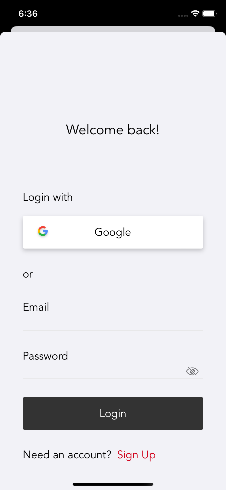
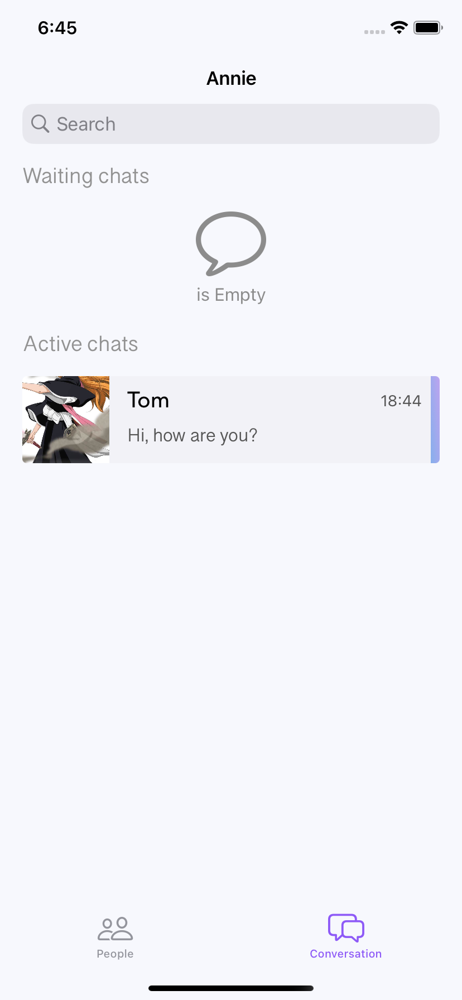

## IChat

 

## About the project

##### IChat, is an application where people can communicate with each other.  Let's start with registration, users can connect through a Google account or create a new account. When creating a new account, users are prompted to fill out standard registration information.

| Initial screen | Registration | Additinal information |
| --- | --- | --- |
||||
##

#####  Also, if the user has an account, he/she can log in through the "Login screen". The user is then taken to the "People screen" where the desired person can be found. Clicking on a user's cell takes the user to the "Profile screen" where they can send a request with a message, open a chat if the request is accepted, or wait for the request to be accepted.

| Login screen | People screen | Profile screen |
| --- | --- | --- |
||||
##

##### When a user submits a request, it goes to the "List screen" under "Waiting chats". After the user touches the request, it offers to "Accept" or "Deny" it. After accepting the request, you can chat with the person Also in the "List screen" you can search for people and requests.

| List screen  | Chat request | Chat |
| --- | --- | --- |
||||
##

##### The app supports light and dark modes, and local notification.

| Light Initial | Dark Initial | People light | People dark | 
| --- | --- | --- | --- |
|||||
